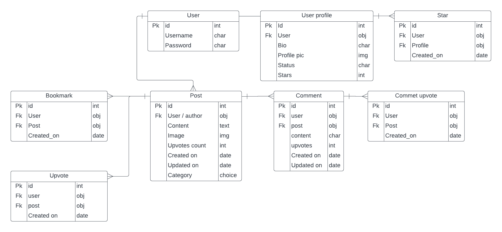

# Fixit - Django Rest Framework Backend

Developed by Jeremy Simons

[Link to live API](https://fixit-drf-api-b3b58b2bc39c.herokuapp.com/)

## Introduction

This is the backend for the forum application Fixit: a community of DIY enthusiasts to support one another.

This documentation will detail the features available via the API, the design, endpoints, testing and instructions for forking the project with your own postgres database. 

## Contents

* [Project Goals](#project-goals) 
    * [For the user](#for-the-user)
    * [For the site owner](#for-the-site-owner)
* [User Experience](#user-experience) 
    * [Target audience](#target-audience)
    * [User requirements](#user-requirements)
    * [User Manual](#user-manual)
    * [User Stories](#user-stories)
* [Technical Design](#technical-design)
    * [Data Models](#data-models)
    * [Endpoints]()
    * [Database Schema](#database-schema)
* [Features](#features)
    * [Feature Ideas for future development](#feature-ideas-for-future-development)
* [Technologies Used](#technologies-used)
* [Deployment & Local Development](#deployment--local-development)
    * [Database](#database)
    * [Heroku deployment](#heroku-deployment)
    * [Forking GitHub Repository](#forking-github-repository)
    * [Cloning GitHub Repository](#cloning-github-repository)
* [Testing](#testing)
* [Validation](#validation)
* [Bugs](#bugs)
* [Credits](#credits)

## Project goals

### For new users
* to sign up to a community of DIY / fix-it-yourself enthusiasts.
* Interact with other users who are able to help me with my own DIY problems

### For existing users
* To interact with other users and get help with my own DIY problems, or help others with theirs.
* To gain recognition for the help I render to other users.

## User Experience

### User stories.

The following user stories reflect the actions a site admin might want to perform on the database.

#### Authentication
* As a new user I want to sign up and create a new account so I can use the site.
* As an existing user I want to log in as an existing user so that I can carry on following the threads that I saved.
* As an authenticated user I want to sign out of my account so that I can securely leave the site.

#### Navigation
* As an authenticated user I want to be directed to my homepage feed so that I can see what the latest posts are.
* As an authenticated user I want to easily navigate back to the home page feed so that I can return to the latest posts.
* As an authenticated user I want to easily navigate to a page showing the trending / most up-voted posts on the site.
* As an authenticated user I want to easily navigate to my profile so I can view it / edit it / see my own posts
* As an authenticated user I want to easily navigate to the signout option so I can leave the site without hassle.

#### Interaction
* As an authenticated user I want to create a new post on the site so that I can ask my specific question to the community.
* As an authenticated user I want to edit my post so that I can amend my query/photo.
* As an authenticated user I want to delete my post so that I can remove my content from the site.
* As an authenticated user I want to be able to upload images as part of my post so that I can illustrate my point.
* As an authenticated user I want to access a page of my posts so far so that I can keep track of the interactions I have had on the site.
* As an authenticated user I want to upvote helpful posts that other people have made.
* As an authenticated user I want to comment on other people’s posts to help them with their query.
* As an authenticated user I want to edit my comment so that I can amend/clarify what I said.
* As an authenticated user I want to delete my comment so I can remove what I no longer say on the site.
* As an authenticated user I want to upvote other people’s helpful comments.
* As an authenticated user I want to give a ‘star’ to users who make helpful contributions to the site.

#### Feed
* As an authenticated user I want to be able to see the most up-voted posts on the site so I can keep up with what is popular
* As an authenticated user I want to see the posts that I have voted for so that I can keep track of posts I like/found helpful.
* As an authenticated user I want to view the most ‘starred’ users so that I can see the contributions of helpful users.

#### Profiles
* As an authenticated user I want to edit my profile so that other users can find out more about me.
* As an authenticated user I want to be able to view other users’ profiles and posts so that I can comment on their posts.

## Technical Design

### Data Models

* Django models were used to represent the tables specified in the technical design of the backend.
* Data points are represented as attributes of the model (inheriting from django's model class).
* For this project, all tables' primary keys are the default django ids for object instances.

#### User model

* This was made using the django allauth library. This library handles all authentication out of the box. From the user it takes a username, email and password.

#### Profile model
* This includes the user who sent the contact message to the site owner as a foreign key.
* The read attribute is only used by the site admin to toggle messages they have read, and filter them out from the admin panel.

| Key | Name | Type | Validation |
|---|---|---|---|
| fk | profile_owner | User | on_delete=models.CASCADE, null=True, |
|  | bio | text | max_length=200, blank=False |
|  | profile_pic | User | upload_to='images/', default="..." |
|  | created_at | DateTime | auto_now_add=True |
|  | updated_at | DateTime | auto_now_add=True |
|  | status | char | max_length=300, choices=CHOICES |

### Endpoints

### Database Schema

Below is an entity relationship diagram for the project. It details how the models detailed above interact with one another.

    
Screenshot

    

## Features

## Technologies Used

## Deployment & Local Development

## Testing

## Validation

## Bugs

## Credits