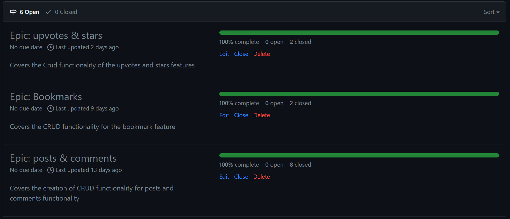
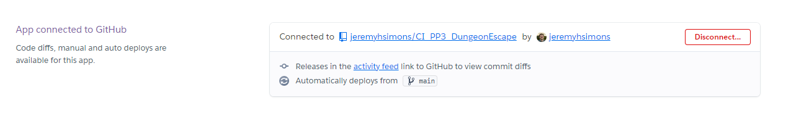
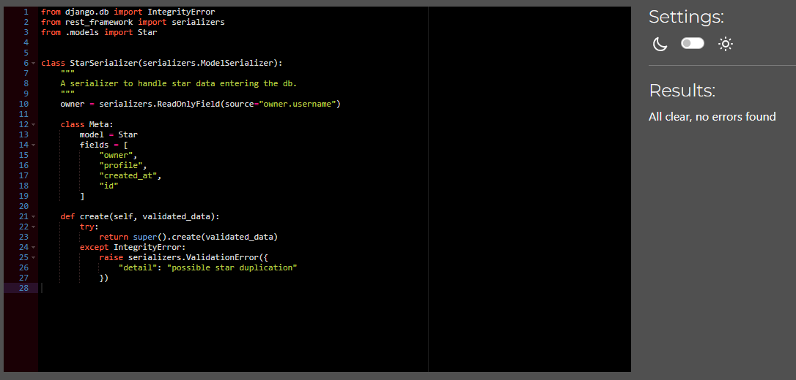
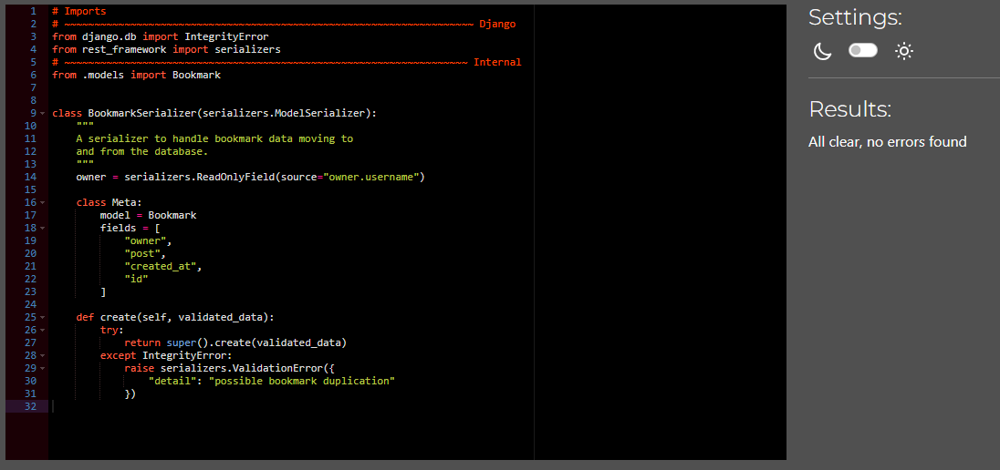
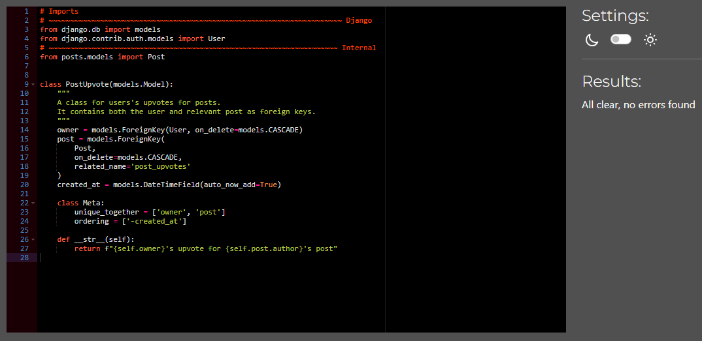

# Fixit - Django Rest Framework Backend

Developed by Jeremy Simons

[Link to live API](https://fixit-drf-api-b3b58b2bc39c.herokuapp.com/)

## Introduction

This is the backend for the forum application Fixit: a community of DIY enthusiasts to support one another.

This documentation will detail the features available via the API, the design, endpoints, testing and instructions for forking the project with your own postgres database. 

## Contents

* [Project Goals](#project-goals) 
    * [For new users](#for-new-users)
    * [For existing users](#for-existing-users)
* [User Experience](#user-experience) 
    * [Target audience](#target-audience)
    * [User requirements](#user-requirements)
    * [User Manual](#user-manual)
    * [User Stories](#user-stories)
* [Agile Workflow](#agile-workflow)
* [Technical Design](#technical-design)
    * [Data Models](#data-models)
    * [Endpoints](#endpoints)
    * [Database Schema](#database-schema)
* [Features](#features)
    * [Feature Ideas for future development](#feature-ideas-for-future-development)
* [Technologies Used](#technologies-used)
* [Deployment & Local Development](#deployment--local-development)
    * [Database](#database)
    * [Heroku deployment](#heroku-deployment)
    * [Forking GitHub Repository](#forking-github-repository)
    * [Cloning GitHub Repository](#cloning-github-repository)
* [Testing](#testing)
* [Validation](#validation)
* [Bugs](#bugs)
* [Credits](#credits)

## Project goals

### For new users
* to sign up to a community of DIY / fix-it-yourself enthusiasts.
* Interact with other users who are able to help me with my own DIY problems

### For existing users
* To interact with other users and get help with my own DIY problems, or help others with theirs.
* To gain recognition for the help I render to other users.

## User Experience

### User stories.

The following user stories reflect the actions a site admin might want to perform on the database.

#### Authentication
* As a new user I want to sign up and create a new account so I can use the site.
* As an existing user I want to log in as an existing user so that I can carry on following the threads that I saved.
* As an authenticated user I want to sign out of my account so that I can securely leave the site.

#### Navigation
* As an authenticated user I want to be directed to my homepage feed so that I can see what the latest posts are.
* As an authenticated user I want to easily navigate back to the home page feed so that I can return to the latest posts.
* As an authenticated user I want to easily navigate to a page showing the trending / most up-voted posts on the site.
* As an authenticated user I want to easily navigate to my profile so I can view it / edit it / see my own posts
* As an authenticated user I want to easily navigate to the signout option so I can leave the site without hassle.

#### Interaction
* As an authenticated user I want to create a new post on the site so that I can ask my specific question to the community.
* As an authenticated user I want to edit my post so that I can amend my query/photo.
* As an authenticated user I want to delete my post so that I can remove my content from the site.
* As an authenticated user I want to be able to upload images as part of my post so that I can illustrate my point.
* As an authenticated user I want to access a page of my posts so far so that I can keep track of the interactions I have had on the site.
* As an authenticated user I want to upvote helpful posts that other people have made.
* As an authenticated user I want to comment on other people’s posts to help them with their query.
* As an authenticated user I want to edit my comment so that I can amend/clarify what I said.
* As an authenticated user I want to delete my comment so I can remove what I no longer say on the site.
* As an authenticated user I want to upvote other people’s helpful comments.
* As an authenticated user I want to give a ‘star’ to users who make helpful contributions to the site.

#### Feed
* As an authenticated user I want to be able to see the most up-voted posts on the site so I can keep up with what is popular
* As an authenticated user I want to see the posts that I have voted for so that I can keep track of posts I like/found helpful.
* As an authenticated user I want to view the most ‘starred’ users so that I can see the contributions of helpful users.

#### Profiles
* As an authenticated user I want to edit my profile so that other users can find out more about me.
* As an authenticated user I want to be able to view other users’ profiles and posts so that I can comment on their posts.

## Agile workflow

An agile methodology was employed for this project. Epics were created and each user story was assigned to an epic. Development of the project was organised into iterations where certain features were implemented to their completion before reviewing the backlog and re-assigning tasks for the next iteration.

This was achieved and tracked using the github issues/projects/kanban board features.

### User stories

User stories and bug reports were uploaded to the project using Github issues templates. User stories were ranked with one of the following labels:

* Must have
* Should have
* Could have
* Wont have (decision made that the feature is not needed and improving other features is higher priority with remaining time)

These categories were used to prioritise the workload.

### Epics

5 epics were created using Github milestones and the user stories (uploaded as issues in the project).

### Kanban board

GitHub Kanban boards were used to track the progress of development:

## Technical Design

### Data Models

* Django models were used to represent the tables specified in the technical design of the backend.
* Data points are represented as attributes of the model (inheriting from django's model class).
* For this project, all tables' primary keys are the default django ids for object instances.

#### User model

* This was made using the django allauth library. This library handles all authentication out of the box. From the user it takes a username, email and password.

#### Profile model
* This represents users' profile data in the database
* The status attribute is used to filter profiles so that users can find and 'star' profiles of users who are likley to help them out on the forum.

| Key | Name | Type | Validation |
|---|---|---|---|
| fk | profile_owner | User | on_delete=models.CASCADE, null=True, |
|  | bio | text | |
|  | profile_pic | ImageField | upload_to='images/', default="..." |
|  | created_at | DateTime | auto_now_add=True |
|  | updated_at | DateTime | auto_now_add=True |
|  | status | char | max_length=300, choices=CHOICES |

#### Post model
* This represents users' post data in the database
* The category attribute is used to filter posts by content type so that users can view content specific to electronics or bikes etc.

| Key | Name | Type | Validation |
|---|---|---|---|
| fk | author | User | on_delete=models.CASCADE, null=True, |
|  | content | text | |
|  | image | ImageField | upload_to='images/', default="..." |
|  | created_at | DateTime | auto_now_add=True |
|  | updated_at | DateTime | auto_now_add=True |
|  | category | char | max_length=300, choices=CHOICES |

#### Comment model
* This represents users' comment data in the database.
* Contains both post and user as foreign keys.

| Key | Name | Type | Validation |
|---|---|---|---|
| fk | author | User | on_delete=models.CASCADE, null=True, |
| fk | post | Post | on_delete=models.CASCADE, null=True, |
|  | content | textfield | blank=False |
|  | created_at | DateTime | auto_now_add=True |
|  | updated_at | DateTime | auto_now_add=True |

#### Star, Bookmark, Post upvote, Comment upvote models.
* These models represent user interactions with other users' content and the data models for each are essentially the same.

| Key | Name | Type | Validation |
|---|---|---|---|
| fk | owner | User | on_delete=models.CASCADE, null=True, |
| fk | post | Post | on_delete=models.CASCADE, null=True, |
|  | created_at | DateTime | auto_now_add=True |

### Endpoints

#### List and create instances
* List all profiles: ../profiles/
* List all posts: ../posts/
* List all comments: ../comments/
* List all bookmarks: ../bookmarks/
* List all stars: ../stars/
* List all post-upvotes: ../post-upvotes/
* List all comment-upvotes: ../comment-upvotes/

#### Retrieve, update and delete instances
* access single profile: ../profiles/primary-key
* access single post: ../post/primary-key
* access single comment: ../comment/primary-key
* access single star: ../star/primary-key
* access single bookmark: ../bookmark/primary-key
* access single post-upvote: ../post-upvote/primary-key
* access single comment-upvote: ../comment-upvote/primary-key

### Database Schema

Below is an entity relationship diagram for the project. It details how the models detailed above interact with one another.

    
Screenshot

    

## Features

For the profile, posts and comments resources, a user can get a list of all instances, create an instance, retrieve and update an instance. For posts and comments users can delete their own instances.

### Profiles

    
Screenshots

    
    

    

### Posts

    
Screenshots

    
    

    
    

    

### Comments

    
Screenshots

    
    

    
    

    

For the stars, bookmarks, and upvotes resources, a user can get a list of all instances, create an instance (only if they haven't created one already for the relevant comment/post/profile), retrieve an instance and delete their own instances. There is no need for the user to update these resources as they do not have any content.

### Stars

    
Screenshots

    
    

    

### Bookmarks

    
Screenshots

    
    

    

### Post Upvotes

    
Screenshots

    
    

    

### Comment Upvotes

    
Screenshots

    
    

    

### Ideas for future development
* Messaging system could be implemented to allow users to interact in greater depth without making the comment feed less helpful for other users.
* Increase the options for types of posts on the site to cover more areas of DIY.

## Technologies Used

### Languages used

* Python

### Frameworks/3rd party Libraries used for Python, CSS, JS

* [Django](https://www.djangoproject.com/) for building the MVT architecture of the site.
* [Django Rest Framework]()
* [Django filters]()
* [Cloudinary](https://cloudinary.com/) for hosting static files.
* [Django Allauth](https://django-allauth.readthedocs.io/en/latest/) for handling all user authentication features in the site.

### Other tools/websites/libraries used
* [Lucidchart](https://lucid.app/) was used to create the entity relationship diagram.
* [Git](https://git-scm.com/) was used for version control.
* [GitHub](https://github.com/) was used for saving and storing files.
* [Gitpod]() was the IDE used for writing and editing code.
* [Heroku](https://id.heroku.com/) was used as the hosting platform for this site.
* [ElephantSQL](https://www.elephantsql.com/) was used to host the site's postgreSQL database.

## Deployment & Local Development

For ease of development, the production database was set up at the beginning of the project to ensure that everything worked correctly. This was especially important for ensuring the accessibility of static files.

### Database

1. To create a managed PostgreSQL database. Create an account or sign up to [ElephantSQL](https://www.elephantsql.com/).

1. Once logged in, click the 'Create New Instance' button.

1. Give your database an appropriate name and select the 'Tiny Turtle' payment plan. This is the option to select if you wish to have a free, hosted database. Larger projects with greater storage needs may require a paid plan.

1. Select your preferred region (i.e. geographically, which data center your database will be hosted at.) and confirm to create your database.

1. After creating your database, navigate to the 'instances' page and select the database you just created. Copy the PostgreSQL URL from the details section. This is required for linking the django project and the deployed heroku version to the production database.

### Heroku Deployment

Before deploying to Heroku, environment variables must be defined in the django project so that local development functions correctly. Once these environment variables are set up in the workspace, the project can be deployed and the environment variables can be copied into heroku as config vars (to ensure the deployed app works correctly with 3rd party dependecies.)

1. Create a file called env.py in the root directory of your workspace and ensure that the file is included in .gitignore. These variables should NOT be committed and pushed to GitHub.
2. import os to the file.
3. os.environ['DATABASE_URL'] = URL copied from ElephantSQL
4. os.environ['SECRET_KEY'] = A randomly generated key of your choosing. This keeps django from serving data to/from an unauthorised source.
5. os.environ['CLOUDINARY_URL'] = The URL from a cloudinary account. This can be found on the following page on the [cloudinary website](#https://cloudinary.com/)

These environment variables can now be accessed and configured in the settings.py file of the django project.

The website was deployed to Heroku using the following process:

1. Login or create an account at [Heroku](https://dashboard.heroku.com/)

2. Click on New > Create new app in the top right of the screen.

3. Add an app name and select location, then click 'create app'.

4. Under the deploy tab of the next page, select connect to GitHub.
5. Log in to your GitHub account when prompted.

6. Select the repository that you want to be connected to the Heroku app.

7. Click on the settings tab.

8. Scroll down to the config vars section, and add config vars specified at the start of this section of the README. Also, include a var with the key 'PORT' and value '8000' to avoid build errors. The end result should look something like this:
KEY: DATABASE_URL
VALUE: postgresurlexample123.com

9. Navigate back to the 'deploy' tab.
10.  Select automatic deploys to allow Heroku to build the site with new changes each time changes are pushed to GitHub.

11.  In the 'manual deploy' section beneath this, make sure the branch selected is 'main' and click deploy branch.

12.  The site should now be built and Heroku should provide a url for the built site.

### Forking GitHub Repository

This repository can be forked using the following process:

1. On the repository's page, go to the top-right of the page underneath the dark ribbon.
1. Click on the fork button
1. You can now work on a fork of this project.

### Cloning GitHub Repository

This repository can be cloned using the following process:

1. Go to this repository's page on GitHub.
1. Click on the code button (not the one in the navbar, but the one right above the file list).
1. Select an option, HTTPS, SSH, GitHub CLI.
1. Copy the url below to your clipboard.
1. Open Git Bash/your IDE terminal.
1. Ensure the directory you are working in is the correct one you want to paste the project into.
1. Type the command '$ git clone'
1. Paste the URL of the repository after this.
1. Hit enter on your keyboard and the project will be cloned.

## Testing

Details of the testing carried out on this API can be viewed in the separate testing.md file [here](#https://github.com/jeremyhsimons/fixit_drf_api/blob/main/TESTING.md)

## Validation

All python files used in the application were passed through Code Institutes [Pep8 validator](https://pep8ci.herokuapp.com/) and passed with no errors or warnings.

    
Profiles

    models.py
    
    

    serializers.py
    
    

    tests.py
    
    

    urls.py
    
    

    views.py
    
    

    
Posts

    models.py
    
    

    serializers.py
    
    

    tests.py
    
    

    urls.py
    
    

    views.py
    
    

    
Comments

    models.py
    
    

    serializers.py
    
    

    tests.py
    
    

    urls.py
    
    

    views.py
    
    

    
Stars

    models.py
    
    

    serializers.py
    
    

    tests.py
    
    

    urls.py
    
    

    views.py
    
    

    
Bookmarks

    models.py
    
    

    serializers.py
    
    

    tests.py
    
    

    urls.py
    
    

    views.py
    
    

    
Post Upvotes

    models.py
    
    

    serializers.py
    
    

    tests.py
    
    

    urls.py
    
    

    views.py
    
    

    
Comment Upvotes

    models.py
    
    

    serializer.py
    
    

    tests.py
    
    

    urls.py
    
    

    views.py
    
    

    
Fixit Project

    permissions.py
    
    

    serializer.py
    
    

    settings.py
    
    

    urls.py
    
    

    views.py
    
    

## Bugs

## Credits