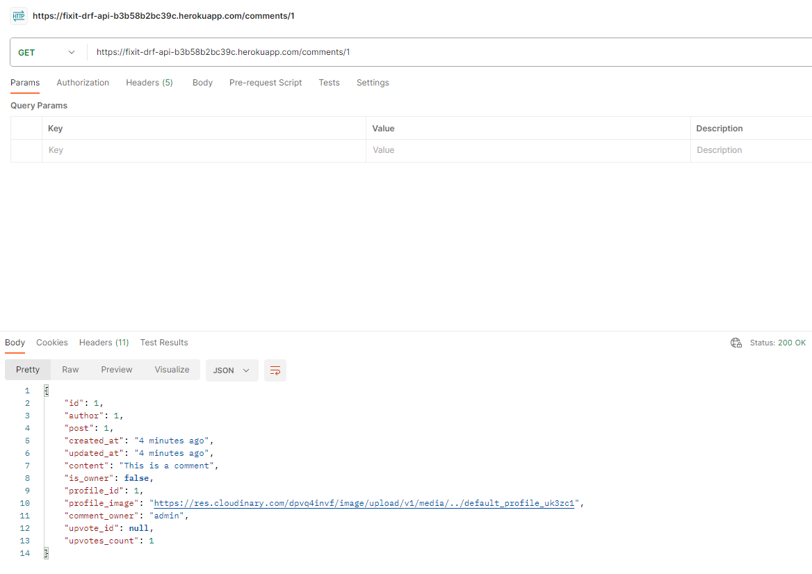
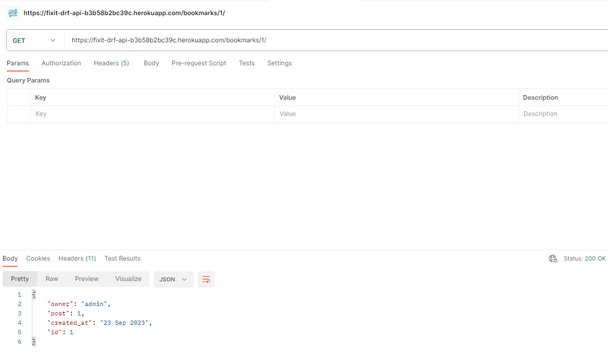

# Fixit DRF API: Testing

## Manual testing using Postman

The website [Postman](https://www.postman.com/product/what-is-postman/) was used to make test requests to the API and check that it returned the expected status codes and JSON responses.

### GET
#### Home page '/'

    
Screenshot

    

#### Profiles page '/profiles/'

    
Screenshot for list

    

    
Screenshot for individual

    

#### Posts page '/posts/'

    
Screenshot for list

    

    
Screenshot for individual

    

#### comments page '/coments/'

    
Screenshot for list

    

    
Screenshot for individual

    

#### Stars page '/stars/'

    
Screenshot for list

    

    
Screenshot for individual

    

#### Bookmarks page '/bookmarks/'

    
Screenshot for list

    

    
Screenshot for individual

    

#### Post upvotes page '/post-upvotes/'

    
Screenshot for list

    

    
Screenshot for individual

    

#### Comment upvotes page '/comment-upvotes/'

    
Screenshot for list

    

    
Screenshot for individual

    

## Automated Testing / Unit tests

Unit tests for all features of the api were built using django rest framework's APITestCase class. All test pass.

### Profile App

    
Screenshot

    

### Posts App

    
Screenshot

    

### Comments App

    
Screenshot

    

### Bookmarks App

    
Screenshot

    

### Stars App

    
Screenshot

    

### Post Upvotes App

    
Screenshot

    

### Comment Upvotes App

    
Screenshot

    

